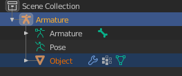

# editamo
Coversion tool from the [glTF](https://www.khronos.org/gltf/) file format to the [Animated OBJ](https://github.com/lmarz/animated_obj) file format

## How to use
Go to [https://lmarz.github.io/editamo](https://lmarz.github.io/editamo/)

or

1. `git clone https://github.com/lmarz/editamo`
2. Open **index.html** in your browser
3. Select your embedded gltf file
4. Download the converted .amo file

### Settings for Blender
Only animate with an armature in Pose Mode  
  
Select both the armature and the object when exporting  
  
Use these settings for the optimal format  

## License
This project is licensed under the MIT license. See [LICENSE](LICENSE) for more details